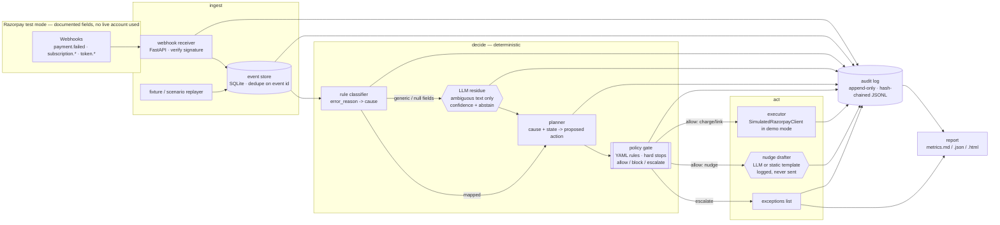

# Rebound — Razorpay AI Buildathon submission

> **Track 3 · AI Revenue Recovery.** When a Razorpay subscription payment fails four times in a row, Razorpay stops retrying and tells the merchant to charge the customer by hand. Rebound picks up from there: it reads *why* the payment failed straight from Razorpay's own documented records, picks a sensible next step for that reason, and checks every step against a rulebook the AI is not allowed to override. Every decision is written to a record nobody — including the AI — can quietly edit afterward.

**Run it yourself in under a minute, no account or API key needed:**

```bash
pip install -e ".[dev]"
pytest -q                    # 54 passed
python -m rebound.cli demo   # runs the 60-scenario batch, writes report.md / report.json
python -m rebound.cli report --html   # writes report.html
python -m rebound.cli verify-audit    # OK: audit chain is valid
```

## Scope decision — no login, no API key

This build deliberately requires **zero credentials**: no Razorpay dashboard login, no
`RAZORPAY_KEY_ID`, no `ANTHROPIC_API_KEY`. The batch/demo path — which is what produces
every number in this README — runs against a fully synthetic, seeded 60-scenario batch
through an in-memory `SimulatedRazorpayClient` (`rebound/sim/fake_razorpay.py`), never
touching a network. The root-cause taxonomy is grounded in Razorpay's **documented**
`error_reason`/`error_source`/`error_step` fields (cited per-cause in
`rebound/classify/taxonomy.py`), not invented labels — see `docs/idea-evaluation.md`
for how that claim was pressure-tested. Where the LLM residue classifier would run
(ambiguous free-text failure reasons), it falls back to the deterministic `abstain`
path when no `ANTHROPIC_API_KEY` is set — the design already treats abstain as a
first-class outcome, not a degraded one. The optional live-Razorpay-webhook demo
moment described in the original plan (`docs/superpowers/plans/2026-09-04-rebound-recovery-agent.md`,
Tasks 21–22) needs the builder's own Razorpay test-mode login and was explicitly
skipped for that reason — recorded honestly rather than faked.

## Latest real run

The numbers below are pasted from an actual `python -m rebound.cli demo` run on this
machine (seed 42, 60 scenarios, 20 held out, 5 duplicate-webhook redeliveries injected).
Regenerate them yourself with the commands above — they are not hand-typed.

- **Duplicates rejected: 5** — **Double charges: 0** (must be 0) — **Policy violations: 0** (must be 0) — **False escalations: 0**
- **Classifier on the held-out set (n=20): 100% accuracy, 5% abstain rate** (1 of 20 correctly routed to a human instead of guessed)
- **All 60 scenarios accounted for** across 7 causes: insufficient_funds (21), bank_or_gateway_error (12), authentication_failed (9), instrument_expired_or_blocked (6), mandate_not_active (5), unknown (4), limit_exceeded (3)
- **4 exceptions**, all `unknown`-cause cases correctly escalated to a human rather than acted on
- Full per-cause table, confusion matrix, and every classification's source-field citation: `report.md` / `report.html` in this repo

## Architecture



**Invariant:** the double-bordered **policy gate** is the only node with an edge to
the money-moving executor. The LLM nodes (hexagons) only ever produce a label or a
sentence, never an authorisation. This is "LLM explains, code decides", made
structural, not just a design principle stated in prose.

## Where AI is — and is not — used

| Step | AI? | Why |
|---|---|---|
| Signature verification, dedupe | No | Security-critical; deterministic |
| Cause classification from documented fields | **No** | Lookup table beats a model on a closed vocabulary — 100% precision by construction |
| Cause classification of *ambiguous* free text | **Yes** — with confidence + abstain | Language is the problem; abstain keeps the error bounded |
| Choosing the action | No | Planner table; auditable |
| Authorising the action | **No** | The gate must be deterministic to be trustworthy |
| Executing money APIs | No | Code only, and only after an `allow` verdict |
| Drafting customer nudge text | **Yes**, or a static template offline | Language; logged, never sent, never touches money |
| Writing this repo | Yes — Claude Code, logged in [`aidlc-docs/process-log.md`](aidlc-docs/process-log.md) | The process is part of the submission |

## Scaling this

Built for a 24-hour demo (SQLite, in-process, synchronous). The seams for production scale
already exist:
- `EventStore` (`rebound/ingest/store.py`) — swap SQLite for Postgres/DynamoDB behind
  the same `insert_if_new(event_id, ...) -> bool` contract; the `event_id` uniqueness
  constraint is what makes concurrent workers safe, with or without SQLite.
- The webhook receiver can hand off to a queue (SQS/Celery) instead of processing in-line;
  `Pipeline.process_failure` doesn't know or care who calls it.
- `Clock` (`rebound/sim/clock.py`) swaps `SimClock` (batch/demo) for `RealClock`
  (production) with no other code change.

## Per-merchant impact (from the real numbers above, not invented)

Industry benchmark: recurring-payment transaction failure rates run ~7.9% (see
`docs/research-synthesis.md`). For a merchant with 10,000 active subscriptions, that's
roughly **790 failures/month** reaching this pipeline. Applying this run's own cause
mix (60-scenario batch): **~78%** land in causes with a real automated recovery path
(insufficient funds, bank/gateway error, expired instrument, mandate re-approval,
limit exceeded — allowed, not blocked, in the table above), **~7%** are ambiguous
`unknown` cases correctly routed to a human rather than guessed, and **0%** ever
reach a money API without passing the gate.

## What broke, and how I got out

Three real issues found and fixed during this build — full detail in
[`FAILURES.md`](FAILURES.md):
1. `rebound demo` crashed on Windows with `UnicodeEncodeError` (cp1252 vs. the `→`/`·`
   characters in the report) — fixed by forcing UTF-8 at every I/O boundary.
2. The original design would have required a real Razorpay client even for the
   offline batch demo, crashing with `AttributeError` on the first allowed action —
   fixed with an in-memory `SimulatedRazorpayClient`, which is also *why* this repo
   needs no login at all.
3. A policy-config off-by-one (`max_attempts_by_cause: 0` for three causes) would
   have silently escalated ~25% of the batch on attempt one regardless of what its
   own rules permitted — caught by tracing the gate's evaluation order by hand
   during plan review, before any code existed, not by a failing test.

## The report itself is designed, not just dumped

The batch report (`report.html`) is the only "frontend" this project has — the rest is a CLI and a JSON/Markdown log. It's built with the **[Impeccable](https://github.com/pbakaus/impeccable)** design skill (installed into this environment specifically for this), following its full direction-selection process: `PRODUCT.md` and `DESIGN.md` at the repo root record the product truth and the built visual world (an audit-dossier / evidence-board direction — exhibits, a case number, a chain-of-custody ledger — chosen via the skill's own resonance-ranked candidate roll, seed `9f883699`). Screenshots and the direction contract are in `.impeccable/review/` and `.impeccable/surfaces/`. The mechanical anti-pattern detector ran clean (0 findings) after three real fix rounds — undersized functional text, banned kicker/eyebrow copy, a mobile horizontal-overflow bug in the confusion matrix — all caught by actually screenshotting both viewports and running the detector, not by assumption.

## The whole process, not just the code

This project is built with **[AI-DLC](aidlc-docs/README.md)** — an AI-Driven Development Lifecycle in which the process is as inspectable as the code:

- `aidlc-docs/inception/` — the baseline: requirements (incl. Amendment A), architecture, components, stack
- `aidlc-docs/efforts/` — every feature/fix as a numbered, state-tracked effort
- `aidlc-docs/process-log.md` — every AI skill and tool used, in order, including what went wrong
- `aidlc-docs/audit.md` — every approval gate and course-correction, in order
- `docs/hackathon-spec.md` — the buildathon brief as captured on 2026-09-04
- `docs/research-synthesis.md` — market scan + 6 verified arXiv papers grounding the idea
- `docs/council-verdict.md` — the 5-advisor LLM council transcript that picked this idea over two alternatives
- `docs/idea-evaluation.md` — the idea scored against a third-party hackathon rubric (43/60 → 47-48/60 projected after sharpening), with the sharpening folded into the requirements as Amendment A
- `docs/superpowers/plans/2026-09-04-rebound-recovery-agent.md` — the 26-task implementation plan, reviewed 5 rounds before any code was written, catching 11 distinct defects along the way
- `docs/video-script.md` — the pitch video script

## Status

| Stage | State |
|---|---|
| Hackathon brief captured | ✅ |
| Research (market + academic) | ✅ `docs/research-synthesis.md` |
| Idea selection (LLM council) | ✅ Candidate A approved — `docs/council-verdict.md` |
| Idea scored against hackathon rubric | ✅ `docs/idea-evaluation.md` |
| AI-DLC Inception (requirements, design) | ✅ all 3 stages approved |
| Implementation plan (reviewed 5 rounds) | ✅ `docs/superpowers/plans/2026-09-04-rebound-recovery-agent.md` |
| Construction | ✅ 54/54 tests passing, `demo` runs end to end, real report committed |
| Pitch video | ✅ `docs/rebound-demo.mp4` |
| Form submitted | ⏳ deadline 5 Sept 2026 — draft answers in `docs/submission.md` |
