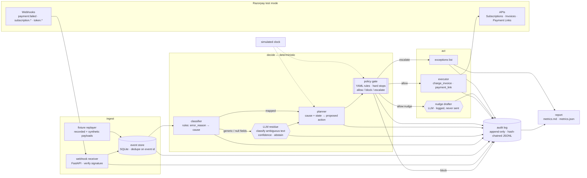

# Inception · Stage 2 — Application Design

**Project:** Rebound · **Date:** 2026-09-04 · **Depth:** standard · **Status:** awaiting approval (Gate I-2)
Derives from `01-requirements.md`. Every component below cites the FR it satisfies.

---

## 1. Architecture



**Invariant:** the double-bordered **policy gate** is the only node with an edge to the money APIs. The LLM nodes (hexagons) have edges only into the planner (as a *label*) and into the audit log (as *text*). This is the "LLM explains, code decides" split from `docs/research-synthesis.md` §3, made structural.

## 2. Components

| Component | Module | Responsibility | Satisfies |
|---|---|---|---|
| Webhook receiver | `rebound/ingest/webhook.py` | FastAPI `POST /webhook`; HMAC-SHA256 check of `X-Razorpay-Signature`; 200 within 5 s; hand off to pipeline | FR-1.1, 1.2, 1.4 |
| Payload adapter | `rebound/ingest/adapter.py` | Translates raw Razorpay webhook JSON (`payment.failed`, `subscription.halted`/`pending`) into `PaymentFailure`/`SubscriptionState`/invoice id for the pipeline; the seam between "what Razorpay sends" and "what our models need" | FR-1.1 (live path), discovered during planning §9 |
| Event store | `rebound/ingest/store.py` | SQLite table `events(event_id PK, received_at, payload)`; `INSERT OR IGNORE` is the dedupe; duplicates logged `duplicate_rejected` | FR-1.3 |
| Fixture replayer | `rebound/ingest/fixtures.py` | Feeds recorded/synthetic payloads through the *same* `process_event()` as live webhooks | FR-1.5 |
| Taxonomy | `rebound/classify/taxonomy.py` | `Cause` enum (7 values) + the documented `error_reason` → cause map with source/step hints and doc URLs as data | FR-2a, §6 of requirements |
| Rule classifier | `rebound/classify/rules.py` | Pure function `classify(payment) -> Classification(cause, provenance="rule")` or `None` if fields are generic/null | FR-2a, 2c |
| LLM classifier | `rebound/classify/llm.py` | Anthropic call with structured output `{cause, confidence, rationale}`; abstain below threshold → `unknown`; disk cache keyed by sha256(input) | FR-2b, 2c, 2d |
| Planner | `rebound/actions/planner.py` | `(cause, subscription_state, attempt_no, sim_time) -> ActionRequest`; deterministic table from requirements §6 "default policy" column | FR-3.1 input |
| Policy gate | `rebound/policy/gate.py` + `policy.yaml` | Hard stops first, then per-cause row; returns `Verdict(allow|block|escalate, rule_id)`; **only** module importing the executor | FR-3.1–3.5 |
| Executor | `rebound/actions/executor.py` | Razorpay SDK: `invoices.issue/charge`, `payment_link.create`; asserts `amount == invoice.amount`; returns outcome | FR-4a, 4b, NFR-Safety |
| Nudge drafter | `rebound/actions/nudge.py` | LLM drafts ≤2-sentence English message per cause; written to audit + exceptions, never sent | FR-4c |
| Simulated clock | `rebound/sim/clock.py` | `Clock` protocol; `RealClock` for `serve`, `SimClock` for `demo`; injected into planner + gate | FR-4f |
| Scenario generator | `rebound/sim/scenarios.py` | Seeded; 60 `Scenario`s from a stated decline-mix; ≥5 from `fixtures/recorded/*.json`; ≥5 flagged `replay_duplicate`; 20 tagged `heldout` | FR-6.1–6.3 |
| Batch runner | `rebound/sim/batch.py` | Runs scenarios through the pipeline with `SimClock`; advances time to exercise cooldowns; collects outcomes | FR-6 |
| Report | `rebound/sim/report.py` | `metrics.json` + `metrics.md`: per-cause allow/block/escalate, violations, false escalations, P/R/abstain on held-out, duplicates rejected, exceptions | FR-6.4, 6.5 |
| Audit log | `rebound/audit/log.py` | `append(stage, payload)` → hash-chained JSONL; `verify()` recomputes chain | FR-5 |
| CLI | `rebound/cli.py` | `rebound demo` · `rebound serve` · `rebound verify-audit` · `rebound report` | FR-8.1 (one command) |

## 3. Data model (pydantic)

```
Event            {event_id, event_type, received_at, payload}
PaymentFailure   {payment_id, subscription_id, amount, method, error_code, error_description,
                  error_source, error_step, error_reason, token_status?}
Classification   {cause: Cause, provenance: "rule"|"llm"|"abstain", confidence?, rationale?, mapped_from?}
SubscriptionState{subscription_id, status, attempt_no, consent: bool, dispute_open: bool,
                  token_status?, last_action_at?}
ActionRequest    {subscription_id, cause, action: Action, amount, attempt_no, sim_time}
Verdict          {decision: "allow"|"block"|"escalate", rule_id, reason}
Outcome          {action, executed: bool, api_ref?, error?}
AuditRecord      {seq, ts, sim_time, event_id, subscription_id, stage, payload, prev_hash, hash}
Scenario         {id, tags: [heldout|replay_duplicate|recorded|synthetic], failure: PaymentFailure,
                  state: SubscriptionState, truth_cause: Cause, truth_action: Action|None}
```

`Action ∈ {charge_invoice, payment_link, nudge, escalate, noop_wait}`.

## 4. Data flow — one halted subscription

```mermaid
sequenceDiagram
    participant R as Razorpay
    participant W as receiver
    participant S as store
    participant C as classifier
    participant P as planner
    participant G as gate
    participant X as executor
    participant A as audit

    R->>W: subscription.halted (x-razorpay-event-id=E1)
    W->>W: verify signature
    W->>S: INSERT OR IGNORE E1
    S-->>A: event_received
    S->>C: PaymentFailure(error_reason=insufficient_funds)
    C-->>A: classified {cause=1, provenance=rule}
    C->>P: cause, state(attempt_no=0)
    P->>G: ActionRequest(charge_invoice, amount, t0)
    G->>G: hard stops → none; row[1]: allow (attempt 1/3)
    G-->>A: policy_verdict allow R-01
    G->>X: execute
    X->>R: POST /invoices/{id}/charge (test mode)
    X-->>A: action_executed
    R->>W: subscription.halted (E1 again — redelivery)
    W->>S: INSERT OR IGNORE E1 → ignored
    S-->>A: duplicate_rejected (no action)
```

The second half is the engineered failure story (FR-6.3): identical payload, zero money movement, one audit line proving it.

## 5. Design decisions (ADR-lite)

| # | Decision | Why | Rejected alternative |
|---|---|---|---|
| D1 | LLM has **no tool access**; it returns a label or text, and only the planner/gate act on it | The four strongest 2026 results all separate probabilistic from deterministic (research synthesis §3); it is the scored "AI judgment" answer | Bedrock/LangChain-style tool-calling agent — drifts on constraints (MACS, arXiv 2608.14068) |
| D2 | Policy in **YAML**, evaluated by ~150 lines of code | Declarative policy is inspectable in the video and diffable in git; OAP pattern (arXiv 2603.20953) | Policy in Python `if`s — not readable by a non-engineer panelist |
| D3 | **SQLite** event store with `INSERT OR IGNORE` on `event_id` | Idempotency without infrastructure; Razorpay documents no idempotency header for Payments | Redis / in-memory set — lost on restart, invisible to the demo |
| D4 | **Hash-chained JSONL** audit, not a database | Tamper-evidence is demonstrable in 10 seconds (`verify-audit` after editing a byte) | Plain logs — no integrity claim |
| D5 | **Simulated clock** injected everywhere time matters | Cooldowns are multi-day; the batch must run in seconds; `RealClock` for `serve` keeps one code path | Sleep/real time — untestable |
| D6 | **Fixture-first**: live webhooks and replayed fixtures share `process_event()` | ngrok/tunnel flakiness must not block the demo; recorded payloads make the synthetic split honest | Live-only demo — single point of failure at hour 20 |
| D7 | Metrics measure the **gate**, not money | Test-mode recovery is deterministic; "₹ recovered" would be a weighted coin (council verdict) | Recovery-rate headline |
| D8 | Python 3.11 + FastAPI + `razorpay` + `anthropic` + pydantic + pytest | Fastest solo path; official SDKs; typed models double as documentation | Node/TS — equal, but the arXiv/eval tooling is Python |

## 6. Where AI is — and is not — used

| Step | AI? | Why |
|---|---|---|
| Signature verification, dedupe | No | Security-critical; deterministic |
| Cause classification from documented fields | **No** | Lookup table beats a model on a closed vocabulary; 100% precision by construction |
| Cause classification of *ambiguous* free text | **Yes** — with confidence + abstain | Language is the problem; abstain path keeps the error bounded |
| Choosing the action | No | Planner table; auditable |
| Authorising the action | **No** | Gate must be deterministic to be trustworthy (0/879 under restrictive policy, arXiv 2603.20953) |
| Executing money APIs | No | Code only |
| Drafting customer nudge text | **Yes** | Language; logged, never sent, no money |
| Arithmetic anywhere | No | LLMs hit 46% on ledger math (FinBalance) |
| Writing this repo | Yes — Claude Code, logged in `aidlc-docs/process-log.md` | The process is part of the submission |

## 7. Failure modes and handling

| Failure | Detection | Handling | Where shown |
|---|---|---|---|
| Duplicate webhook delivery | `INSERT OR IGNORE` no-op | `duplicate_rejected`, no action | Report + video (engineered) |
| Bad signature | HMAC mismatch | 400, audit `signature_rejected` | Audit |
| Generic/null error fields (UPI, dashboard) | rule classifier returns `None` | LLM residue → likely abstain → `unknown` → escalate | Report exceptions list |
| LLM unavailable / timeout | exception | classify as `unknown`, provenance `abstain`, continue | Audit |
| Razorpay API error on execute | SDK exception | audit `action_failed`, attempt not consumed, escalate after 2 | Audit + exceptions |
| Tunnel down during live demo | receiver idle | fixture mode carries the batch; noted in `FAILURES.md` | FAILURES.md |
| Audit tampering | `verify-audit` chain break | non-zero exit, first bad seq printed | Video |

## 8. Repository layout

```
rebound/
  __init__.py  cli.py
  ingest/    webhook.py  store.py  fixtures.py  adapter.py
  classify/  taxonomy.py  rules.py  llm.py
  actions/   planner.py  executor.py  nudge.py
  policy/    gate.py  policy.yaml
  audit/     log.py
  sim/       clock.py  scenarios.py  batch.py  report.py
fixtures/    recorded/*.json   (real test-mode captures, secrets stripped)
tests/       test_gate.py  test_rules.py  test_store_dedupe.py  test_audit_chain.py  test_batch_smoke.py
FAILURES.md  README.md  .env.example  pyproject.toml  Makefile
aidlc-docs/  docs/
```

## 9. Construction plan — efforts

| Effort | Ref | Units | Depends on | Pattern |
|---|---|---|---|---|
| **001** | `scaffold-ingest-audit` | pyproject, CLI skeleton, `Clock`, event store + dedupe, audit log + verify, webhook receiver, fixture replayer, tests | — | inline |
| **002** | `taxonomy-classifier` | taxonomy data, rule classifier, LLM residue + cache + abstain, tests | 001 | parallel subagent A |
| **003** | `policy-gate-actions` | `policy.yaml`, gate + hard stops, planner, executor (Razorpay SDK), nudge drafter, gate table tests | 001 | parallel subagent B |
| **004** | `sim-batch-report` | scenario generator (seeded, held-out, duplicates), batch runner, report, `make demo` end-to-end | 002, 003 | inline |
| **005** | `hour-zero-capture` | with real test keys: create Plan + Subscription, fail ×4, capture `payment.failed`/`subscription.halted`/card-reason payloads into `fixtures/recorded/` | `.env` from user | inline — **can start as soon as keys exist**, independent of 001–004 |
| **006** | `deliverables` | README, FAILURES.md final pass, Mermaid, clean-clone dry run, video script, `docs/submission.md` | 004, 005 | inline |

002 ∥ 003 use the `agent-swarm` **peer-parallel** pattern with disjoint file ownership; 003's gate uses the **governed** pattern (its test table must pass before merge). Each effort gets `aidlc-docs/efforts/{NNN}-{ref}/effort-state.md` + `requirements-delta.md`.

---
*Approval gate for this stage: `audit.md` → Gate I-2. On Continue, the baseline is established and Effort 001 begins.*
